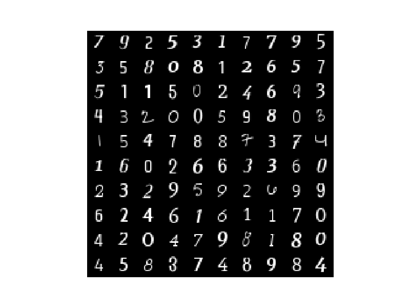

```
$ python generate_data.py data/fontdata_small.mat --num_fonts 200 --pixels 20

Generating font-based training data...
  [####################################]  100%
Successfully created training data!

$ python visualize_data.py data/fontdata_small.mat
```


