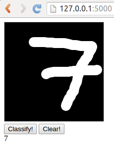

```
$ python generate_data.py data/fontdata_small.mat --num_fonts 200 --pixels 20

Generating font-based training data...
  [####################################]  100%
Successfully created training data!

$ python generate_data.py data/fontdata_full.mat --num_fonts 1000 --pixels 20

$ python visualize_data.py data/fontdata_small.mat

$ python train.py data/fontdata_small.mat data/fontweights_small.mat
...
Training Set Accuracy: 94.15

$ python predict.py data/fontdata_small_full.mat data/fontweights_small.mat
Loading saved Neural Network parameters ...
Test Set Accuracy: 91.17
```



